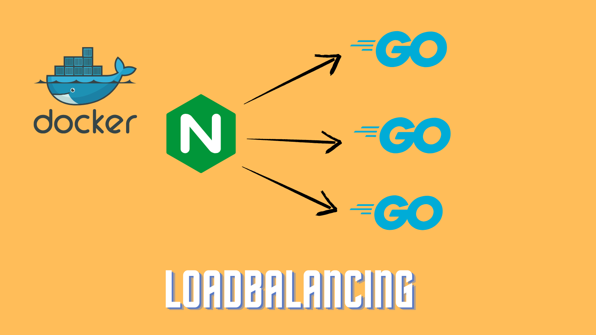

# LoadBalancerDemo



## Overview
This project demonstrates a simple load balancing setup using Nginx as a reverse proxy to distribute traffic across multiple Go service instances.

## Architecture
- **Nginx**: Acts as a load balancer, distributing incoming requests across three Go service instances
- **Go Services**: Three identical service instances that handle HTTP requests
- **Docker**: Everything is containerized using Docker and orchestrated with Docker Compose

## Endpoints
- `/`: Welcome page showing server ID
- `/getResult`: Returns a message with the current server ID

## Setup and Running
1. Make sure you have Docker and Docker Compose installed
2. Clone this repository
3. Run the following command:
   ```bash
   docker-compose up --build -d
   ```

## Project Structure
- `nginx/`: Contains Nginx configuration and Dockerfile
- `golangService/`: Contains Go service code and Dockerfile
- `docker-compose.yml`: Defines the multi-container application setup
